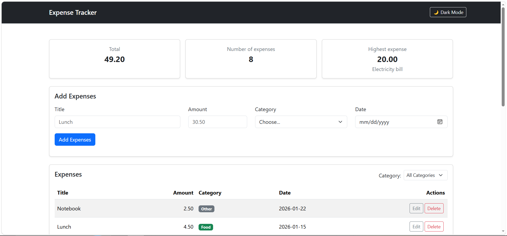
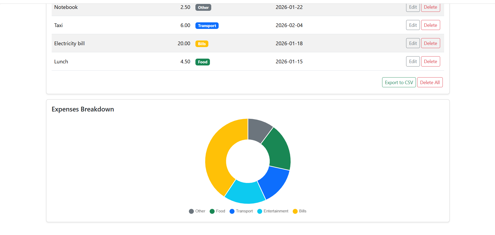
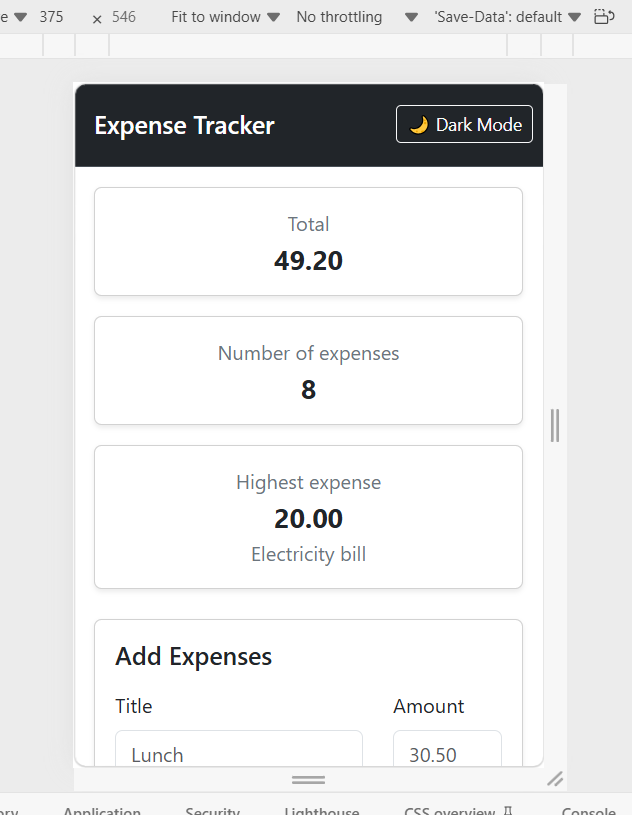
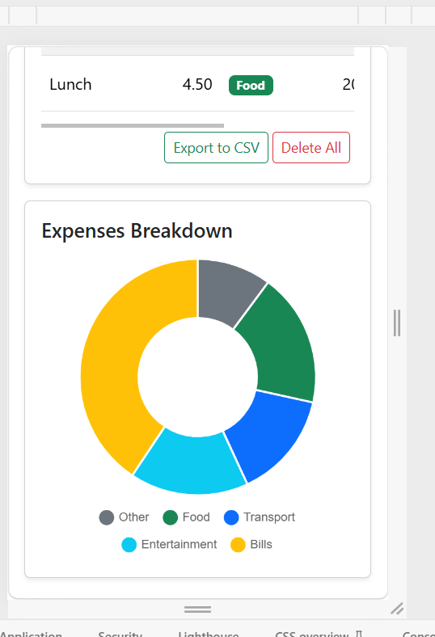
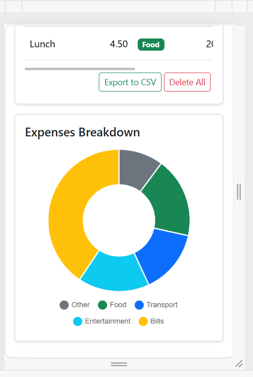

# Expense Tracker

Expense Tracker is a web application that allows users to manage their expenses by adding, updating, deleting, and displaying them within specific categories. It also provides an expense summary—including total spent, transaction count, and highest expense—along with a visual chart representing expense distribution across categories.

## How to run

**Backend**

1. Open the project folder in VS Code.
2. Create data base on pgAdmin with `expense_tracker` name.
3. Run code in `backend/schema.sql` in pgAdmin Query Tool to create table and insert data (sample expenses) to test .
4. Create a `.env` file in the `backend` directory and add your database credentials.
5. Open `backend` folder in integrated terminal and run `node server.js`.

**Frontend**

6. Open `frontend/index.html` in your web browser or run it using Live Server.

## Features

- [x] Add an expense (with validation)
- [x] Delete an expense
- [x] Edit an expense
- [x] Clear all expenses (Delete All)
- [x] Export expenses data
- [x] Filter by category
- [x] Summary cards (total, count, highest)
- [x] Data is saved in a PostgreSQL database
- [x] Interactive data visualization using Chart.js
- [x] Fully responsive UI built with Bootstrap 5

## Screenshots

### Desktop

### Mobile

## What was the hardest part?

The most challenging part was implementing the async logic and API integration using JavaScript due to limited prior practice. It required time to research and understand the concepts, which I resolved by reading documentation, watching videos and practicing step-by-step.

"# ExpenseTracker"
"# expensesTrackerBack"
"# expensesTrackerBack"
